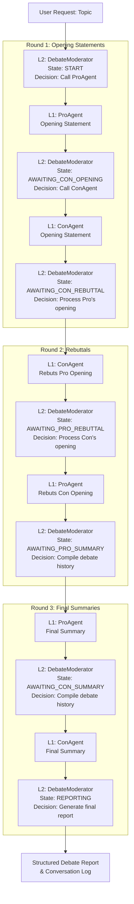

# 🎭 AI Debate Club

A sophisticated multi-agent AI system that orchestrates formal debates between specialized AI agents. Built with hierarchical agent architecture using the OpenAI Agents framework, featuring both CLI and web interfaces.

[](https://python.org)
[](https://openai.com)
[](https://streamlit.io)
[](LICENSE)

## 🚀 Overview

The AI Debate Club implements a **multi-agent debate system** where two specialized AI agents engage in formal debates on any given topic, moderated by a third "orchestrator" agent that enforces strict debate protocols.

### Key Features

- 🎯 **Dynamic Topic Input**: Debate any topic via command-line or web interface
- 🧠 **Latest LLM Support**: GPT-5, GPT-5 Mini, GPT-4.1, GPT-4o, GPT-4-Turbo, GPT-4o-mini
- 🖥️ **Streamlit Web Interface**: Professional UI with two-tab design
- 💬 **Conversation View**: Messenger-style Pro/Con chat interface
- 📊 **Structured Reports**: Professional debate summaries with bullet points
- 📋 **Verbose Logging**: Detailed step-by-step execution traces
- 🔄 **Dual Environment**: Works in CLI, web interface, and Jupyter notebooks
- 🏗️ **Hierarchical Architecture**: L2 Orchestrator managing L1 specialist agents
- 🛡️ **Windows Compatibility**: Unicode character handling for Windows terminals

## 🏛️ Architecture



### Agent Interaction Flow

**User Request → (L2 Orchestrator → L1 Agents) × 3 rounds → L2 Orchestrator → Output**

1. **Round 1**: Opening statements (Pro → Con)
2. **Round 2**: Rebuttals (Con rebuts Pro → Pro rebuts Con)  
3. **Round 3**: Final summaries (Pro → Con)
4. **Output**: Orchestrator compiles structured report

### Agent Hierarchy

- **L2 - Orchestrator (`DebateModerator`)**: Master agent managing debate flow through a strict state machine protocol
- **L1 - Specialists (`ProAgent`, `ConAgent`)**: Isolated debater agents with opposing stances, called as tools by the orchestrator

## 📦 Installation

### Prerequisites

- Python 3.8+
- OpenAI API Key

### Setup

1. **Clone the repository:**
   ```bash
   git clone https://github.com/kpjwong/ai-debate-club.git
   cd ai-debate-club
   ```

2. **Install dependencies:**
   ```bash
   pip install -r requirements.txt
   ```

3. **Configure API Key:**
   
   **Option A: Environment Variable (Recommended)**
   ```bash
   export OPENAI_API_KEY="sk-your-api-key-here"
   ```
   
   **Option B: Direct Configuration**
   Edit `debate_club.py` and replace:
   ```python
   OPENAI_API_KEY = "sk-your-api-key-here"  # Replace with your actual key
   ```

## 🎮 Usage

### 🖥️ Web Interface (Recommended)

**Launch the Streamlit web application:**
```bash
streamlit run app.py
```

**Features:**
- **📋 Orchestrator Report Tab**: Professional debate summary with structured sections
- **💬 Conversation UI Tab**: Messenger-style chat showing Pro/Con exchanges
- **⚙️ Configuration Panel**: Topic input, model selection, turn limits
- **📊 Progress Indicators**: Real-time debate progress with meaningful steps
- **📥 Download Reports**: Export debate reports as Markdown files

### 🔧 Command Line Interface

**Basic Usage:**
```bash
python debate_club.py
```

**Custom Topic:**
```bash
python debate_club.py --topic "Should artificial intelligence be regulated?"
```

**Specify Model:**
```bash
python debate_club.py --topic "Remote work vs office work" --model gpt-5-2025-08-07
```

**Full Options:**
```bash
python debate_club.py \
  --topic "Climate change vs economic growth" \
  --model gpt-4o \
  --max-turns 25
```

### Available Arguments

| Argument | Description | Default | Options |
|----------|-------------|---------|---------|
| `--topic` | Debate topic/motion | "Social media platforms should be regulated..." | Any string |
| `--model` | OpenAI model for all agents | `gpt-4o` | `gpt-5-2025-08-07`, `gpt-5-mini-2025-08-07`, `gpt-4.1-2025-04-14`, `gpt-4o`, `gpt-4-turbo`, `gpt-4o-mini` |
| `--max-turns` | Maximum debate turns | `20` | Any integer |

### 📓 Jupyter Notebook Usage

```python
# Copy the entire debate_club.py content into a cell, then:

# Option 1: Use defaults
await main()

# Option 2: Custom parameters
custom_topic = "Is remote work the future of work?"
custom_model = "gpt-5-2025-08-07"
await main(topic_override=custom_topic, model_override=custom_model)
```

## 📋 Debate Flow

The system follows a rigid **7-state debate protocol**:

1. **START** → ProAgent provides opening statement
2. **AWAITING_CON_OPENING** → ConAgent provides opening statement  
3. **AWAITING_CON_REBUTTAL** → ConAgent rebuts Pro's opening
4. **AWAITING_PRO_REBUTTAL** → ProAgent rebuts Con's opening
5. **AWAITING_PRO_SUMMARY** → ProAgent provides final summary
6. **AWAITING_CON_SUMMARY** → ConAgent provides final summary
7. **REPORTING** → Orchestrator compiles structured report

## 🖼️ Screenshots

### Web Interface - Orchestrator Report
Professional debate summary with structured bullet points and key arguments.

### Web Interface - Conversation UI  
Messenger-style interface showing the back-and-forth between Pro (left, green) and Con (right, red) agents.

## 📊 Sample Output

### CLI Output
```
AI DEBATE CLUB
==================================================
Topic: Should social media be regulated as public utilities?
Model: gpt-4o
Max Turns: 20
==================================================

>>> Starting run for Agent: 'DebateModerator' with Query: 'Should social media be regulated as public utilities?' <<<

==================== [ SWITCHING CONTEXT ] ====================
Orchestrator delegating to: ProAgent
Task: The debate motion is: Should social media be regulated as public utilities...
=================================================================

==================== [ RETURNING CONTEXT ] ====================
ProAgent completed task
Returning control to Orchestrator
=================================================================
```

### Structured Report Output
```markdown
## Debate Report: Should social media platforms be regulated as public utilities?

### Opening Statement (Pro)
- **Democratic Access**: Regulation ensures equal access to essential communication platforms
- **Consumer Protection**: Government oversight prevents data exploitation and privacy violations
- **Market Stability**: Utility regulation reduces platform monopolization and promotes fair competition

### Opening Statement (Con)
- **Innovation Stifling**: Regulation slows technological advancement and platform evolution
- **Free Market Efficiency**: Private competition drives better services than government control
- **Regulatory Complexity**: Social media differs fundamentally from traditional utilities

### Rebuttal (Con)
- **On Democratic Access**: Private platforms already serve billions globally without utility status
- **On Consumer Protection**: Market competition and existing laws provide sufficient protection
- **On Market Stability**: Regulation may entrench current players and reduce innovation

### Rebuttal (Pro)
- **On Innovation Stifling**: Utilities like electricity and water continue innovating under regulation
- **On Free Market Efficiency**: Current system allows data exploitation and market manipulation
- **On Regulatory Complexity**: New regulatory frameworks can adapt to digital platform realities

### Final Position (Pro)
- **Essential Infrastructure**: Social media is now critical infrastructure requiring public oversight
- **Democratic Values**: Regulation protects free speech and prevents platform censorship
- **Public Interest**: Utility regulation serves public good over private profit

### Final Position (Con)
- **Economic Freedom**: Private ownership drives innovation and economic growth
- **Global Competition**: Regulation may disadvantage domestic platforms in global markets
- **User Choice**: Market forces and user preferences effectively regulate platform behavior

---
*Debate completed by AI Debate Club system*
```

## 🔧 Configuration

### Agent Instructions

You can modify agent behavior by editing the instructions in their creation functions:

```python
def create_pro_agent(model: str) -> Agent:
    return Agent(
        name="ProAgent",
        model=model,
        instructions="Your custom instructions here...",
        tools=[]
    )
```

### Debate Flow Modification

The orchestrator's state machine can be customized by modifying the instructions in `create_orchestrator_agent()`.

### Unicode Compatibility

The system includes comprehensive Unicode character cleaning for Windows compatibility:

```python
def clean_unicode_for_windows(text: str) -> str:
    """Clean Unicode characters that cause Windows terminal encoding issues"""
    # Handles em-dashes, smart quotes, bullet points, etc.
```

## 📁 Project Structure

```
ai-debate-club/
├── debate_club.py          # Core multi-agent debate system
├── app.py                  # Streamlit web interface
├── requirements.txt        # Dependencies (openai-agents, streamlit)
├── README.md              # This file
├── CLAUDE.md              # Development documentation
├── .gitignore             # Git ignore rules
├── logs/                  # Debug logs and conversation history
└── .claude/               # Claude Code configuration
```

## 🛠️ Development

### Code Organization

The codebase is organized into clear sections:

1. **Imports & Configuration** - Dependencies and setup
2. **L1 Specialist Agents** - ProAgent and ConAgent definitions  
3. **Agent-as-Tool Wrapper** - Hierarchical architecture implementation
4. **L2 Orchestrator Agent** - DebateModerator with state machine
5. **Verbose Runner** - Detailed logging and conversation extraction
6. **Main Execution** - CLI, web interface, and Jupyter entry points

### Adding New Agents

To extend the system (e.g., add a `FactCheckerAgent`):

1. Create the new L1 agent
2. Wrap it using `create_tool_from_agent()`
3. Add to `orchestrator_tools` list
4. Update orchestrator instructions

### Debug Logging

The system automatically generates comprehensive debug logs:
- `logs/conversation_[timestamp].json` - Structured conversation data
- `logs/report_[timestamp].md` - Final debate report
- `logs/raw_debug_[timestamp].json` - Raw agent interaction data

## 🤝 Contributing

1. Fork the repository
2. Create a feature branch (`git checkout -b feature/new-feature`)
3. Make your changes
4. Add tests if applicable
5. Commit your changes (`git commit -am 'Add new feature'`)
6. Push to the branch (`git push origin feature/new-feature`)
7. Create a Pull Request

## 📝 License

This project is licensed under the MIT License - see the [LICENSE](LICENSE) file for details.

## 🙏 Acknowledgments

- Built with the [OpenAI Agents](https://github.com/openai/openai-agents) framework
- Powered by OpenAI's GPT models (GPT-5, GPT-4.1, GPT-4o)
- Web interface built with [Streamlit](https://streamlit.io/)
- Developed with [Claude Code](https://claude.ai/code)

## 📞 Support

If you encounter any issues or have questions:

1. Check the [Issues](https://github.com/kpjwong/ai-debate-club/issues) page
2. Create a new issue with detailed information
3. Include your Python version, OS, and error messages
4. Check the `logs/` directory for debug information

---

**Happy Debating!** 🎭