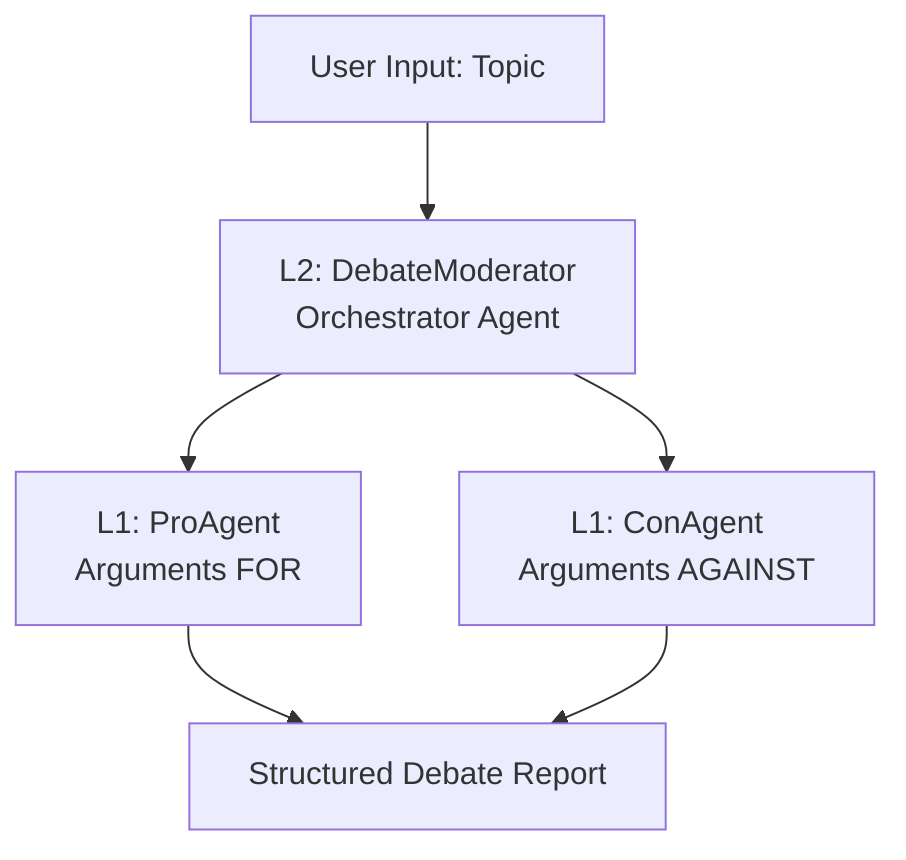

# 🎭 AI Debate Club

A sophisticated multi-agent AI system that orchestrates formal debates between specialized AI agents. Built with hierarchical agent architecture using the OpenAI Agents framework.

[](https://python.org)
[](https://openai.com)
[](LICENSE)

## 🚀 Overview

The AI Debate Club implements a **multi-agent debate system** where two specialized AI agents engage in formal debates on any given topic, moderated by a third "orchestrator" agent that enforces strict debate protocols.

### Key Features

- 🎯 **Dynamic Topic Input**: Debate any topic via command-line arguments
- 🧠 **Multiple LLM Support**: Choose from GPT-4o, GPT-4-Turbo, or GPT-4o-mini
- 📊 **Verbose Logging**: Detailed step-by-step execution traces
- 🔄 **Dual Environment**: Works in CLI and Jupyter notebooks
- 🏗️ **Hierarchical Architecture**: L2 Orchestrator managing L1 specialist agents
- 📋 **Structured Output**: Professional debate reports with clear sections

## 🏛️ Architecture



### Agent Hierarchy

- **L2 - Orchestrator (`DebateModerator`)**: Master agent managing debate flow through a strict state machine protocol
- **L1 - Specialists (`ProAgent`, `ConAgent`)**: Isolated debater agents with opposing stances

## 📦 Installation

### Prerequisites

- Python 3.8+
- OpenAI API Key

### Setup

1. **Clone the repository:**
   ```bash
   git clone https://github.com/kpjwong/ai-debate-club.git
   cd ai-debate-club
   ```

2. **Install dependencies:**
   ```bash
   pip install -r requirements.txt
   ```

3. **Configure API Key:**
   
   **Option A: Environment Variable (Recommended)**
   ```bash
   export OPENAI_API_KEY="sk-your-api-key-here"
   ```
   
   **Option B: Direct Configuration**
   Edit `debate_club.py` and replace:
   ```python
   OPENAI_API_KEY = "sk-your-api-key-here"  # Replace with your actual key
   ```

## 🎮 Usage

### Command Line Interface

**Basic Usage:**
```bash
python debate_club.py
```

**Custom Topic:**
```bash
python debate_club.py --topic "Should artificial intelligence be regulated?"
```

**Specify Model:**
```bash
python debate_club.py --topic "Remote work vs office work" --model gpt-4o
```

**Full Options:**
```bash
python debate_club.py \
  --topic "Climate change vs economic growth" \
  --model gpt-4-turbo \
  --max-turns 25
```

### Available Arguments

| Argument | Description | Default | Options |
|----------|-------------|---------|---------|
| `--topic` | Debate topic/motion | "Social media platforms should be regulated..." | Any string |
| `--model` | OpenAI model for all agents | `gpt-4o-mini` | `gpt-4o-mini`, `gpt-4o`, `gpt-4-turbo` |
| `--max-turns` | Maximum debate turns | `20` | Any integer |

### Jupyter Notebook Usage

```python
# Copy the entire debate_club.py content into a cell, then:

# Option 1: Use defaults
await main()

# Option 2: Custom parameters
custom_topic = "Is remote work the future of work?"
custom_model = "gpt-4o"
await main(topic_override=custom_topic, model_override=custom_model)
```

## 📋 Debate Flow

The system follows a rigid **7-state debate protocol**:

1. **START** → ProAgent provides opening statement
2. **AWAITING_CON_OPENING** → ConAgent provides opening statement  
3. **AWAITING_CON_REBUTTAL** → ConAgent rebuts Pro's opening
4. **AWAITING_PRO_REBUTTAL** → ProAgent rebuts Con's opening
5. **AWAITING_PRO_SUMMARY** → ProAgent provides final summary
6. **AWAITING_CON_SUMMARY** → ConAgent provides final summary
7. **REPORTING** → Orchestrator compiles structured report

## 📊 Sample Output

```
🎭 AI DEBATE CLUB
==================================================
📝 Topic: Should social media be regulated as public utilities?
🧠 Model: gpt-4o-mini
🔄 Max Turns: 20
==================================================

🎯 Starting debate on topic: 'Should social media be regulated as public utilities?'
📊 Max turns: 20
🤖 Orchestrator: DebateModerator

==================== [ SWITCHING CONTEXT ] ====================
Orchestrator delegating to: ProAgent
Task: The motion is: Should social media be regulated as public utilities?...
=================================================================

🤔 [1] REASONING → ACTION
   └─ Calling: ProAgent
   └─ Arguments: {"query": "The motion is: Should social media be regulated as public utilities? Provide your opening statement."}

👀 [2] OBSERVATION
   └─ From: ProAgent
   │  Social media platforms have become essential infrastructure for modern communication...
   │  [Compelling arguments for regulation follow]
```

## 🔧 Configuration

### Agent Instructions

You can modify agent behavior by editing the instructions in their creation functions:

```python
def create_pro_agent(model: str) -> Agent:
    return Agent(
        name="ProAgent",
        model=model,
        instructions="Your custom instructions here...",
        tools=[]
    )
```

### Debate Flow Modification

The orchestrator's state machine can be customized by modifying the instructions in `create_orchestrator_agent()`.

## 📁 Project Structure

```
ai-debate-club/
├── debate_club.py          # Main application
├── requirements.txt        # Dependencies
├── README.md              # This file
├── CLAUDE.md              # Development documentation
├── .gitignore             # Git ignore rules
└── .claude/               # Claude Code configuration
```

## 🛠️ Development

### Code Organization

The codebase is organized into clear sections:

1. **Imports & Configuration** - Dependencies and setup
2. **L1 Specialist Agents** - ProAgent and ConAgent definitions  
3. **Agent-as-Tool Wrapper** - Hierarchical architecture implementation
4. **L2 Orchestrator Agent** - DebateModerator with state machine
5. **Verbose Runner** - Detailed logging system
6. **Main Execution** - CLI and Jupyter entry points

### Adding New Agents

To extend the system (e.g., add a `FactCheckerAgent`):

1. Create the new L1 agent
2. Wrap it using `create_tool_from_agent()`
3. Add to `orchestrator_tools` list
4. Update orchestrator instructions

## 🤝 Contributing

1. Fork the repository
2. Create a feature branch (`git checkout -b feature/new-feature`)
3. Make your changes
4. Add tests if applicable
5. Commit your changes (`git commit -am 'Add new feature'`)
6. Push to the branch (`git push origin feature/new-feature`)
7. Create a Pull Request

## 📝 License

This project is licensed under the MIT License - see the [LICENSE](LICENSE) file for details.

## 🙏 Acknowledgments

- Built with the [OpenAI Agents](https://github.com/openai/openai-agents) framework
- Powered by OpenAI's GPT models
- Developed with [Claude Code](https://claude.ai/code)

## 📞 Support

If you encounter any issues or have questions:

1. Check the [Issues](https://github.com/kpjwong/ai-debate-club/issues) page
2. Create a new issue with detailed information
3. Include your Python version, OS, and error messages

---

**Happy Debating!** 🎭